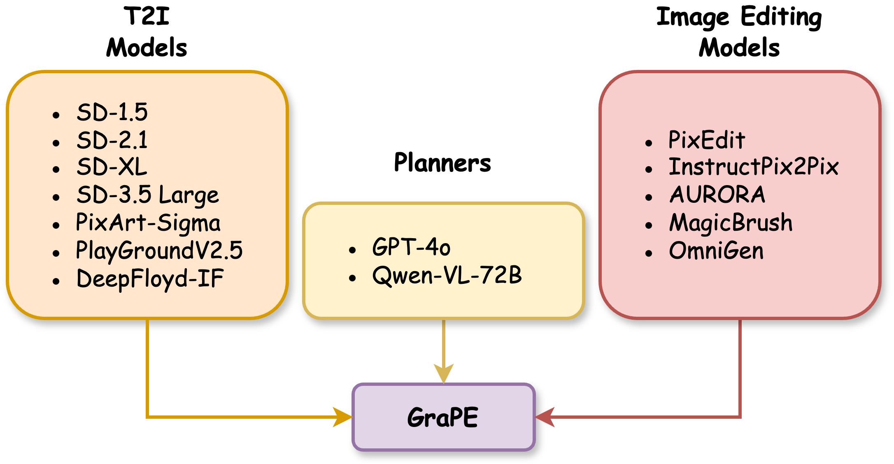

# GraPE : A Generate Plan Edit Framework for Compositional T2I Symthesis
### [Project Page](https://dair-iitd.github.io/GraPE/) | [Paper](https://arxiv.org/abs/2412.06089)


## Installation
Setup any environment compatible with the editing-model of your choice. We use [PixEdit](https://github.com/dair-iitd/PixEdit) environment, that supports latest T2I models from diffusers.

* Ensure `openai` and latest `diffusers` is installed.
* Add your openai-api-key in [planners/FEW_SHOT.py](./planners/FEW_SHOT.py)

## Usage
This repository currently supports the following models to be used as different components in `GraPE`.
* All T2I Models / Planners and PixEdit is supported by [PixEdit](https://github.com/dair-iitd/PixEdit) environment.

* Adding support for additional model is easy, simply create an `Editor` class with `edit_image` method!!

Refer to [Demo.ipynb](./Demo.ipynb) noteboook for example usage!

## Benchmarks
The prompts used in `T2I-Compbench`, `Flickr-Bench` and `ConceptMix` are placed in `benchmarks` directory.

## Citation
If you find this repository useful, please consider giving a star ⭐ and citation.
```text
@misc{goswami2024grapegenerateplaneditframeworkcompositional,
      title={GraPE: A Generate-Plan-Edit Framework for Compositional T2I Synthesis}, 
      author={Ashish Goswami and Satyam Kumar Modi and Santhosh Rishi Deshineni and Harman Singh and Prathosh A. P and Parag Singla},
      year={2024},
      eprint={2412.06089},
      archivePrefix={arXiv},
      primaryClass={cs.CV},
      url={https://arxiv.org/abs/2412.06089}, 
}
```